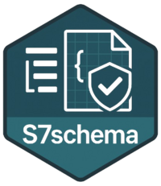

<!-- README.md is generated from README.Rmd. Please edit that file -->

# S7schema <a href="https://novonordisk-opensource.github.io/S7schema/"></a>

<!-- badges: start -->

[](https://github.com/NovoNordisk-OpenSource/S7schema/actions/workflows/check_and_co.yaml)
<!-- badges: end -->

S7schema provides a generic way of working with yaml config files. The
main functionality is captured in the `S7schema()` class that:

1.  Uses [S7](https://rconsortium.github.io/S7/) for easy downstream use
    in other packages (e.g. new child classes and methods).
2.  Uses [‘ajv’](https://ajv.js.org) for validation of the config file
    given [JSON schema](https://json-schema.org).
3.  Inherits from `list` ensuring a seamless integration into existing
    code using the configuration entries.

## Installation

``` r
# Install the latest released version from CRAN:
install.packages("S7schema")

# Install the development version from GitHub:
pak::pak("NovoNordisk-OpenSource/S7schema")
```

## Usage

``` r
library(S7schema)
```

A new instance of an `S7schema` class can be initiated with:

``` r
config <- S7schema("path/to/my/config.yml", "path/to/my/schema.json")
```

Since config is a list it can be updated (here adding an “a” element):

``` r
config$a <- 2
```

And it can be validated again:

``` r
validate(config)
```

Which will now throw an error if `a = 2` is an illegal entry according
to the schema in `"path/to/my/schema.json"`.

## Learn more

- `vignette("S7schema")` — Getting started
- `vignette("use-in-package")` — Use S7schema in your package
